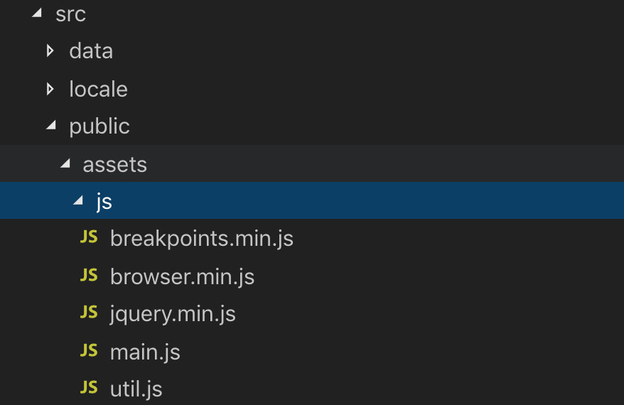

# sam-and-his-friends-vendor

Libs for sam-and-his-friends

There are few 3rd libs in repo [`sam-and-his-friends`](https://github.com/tningjs/sam-and-his-friends) that was copied as `.min.js`:

This effects the code quanlity because the analytics tool will analyze those files.

This Repo extrac them out and publish as a npm package.